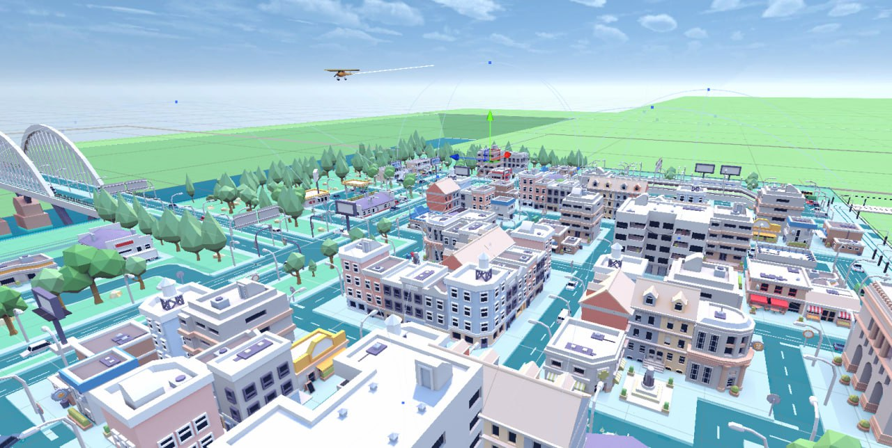
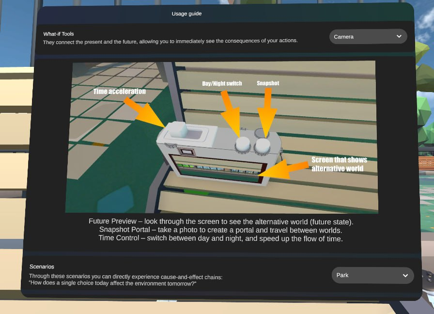
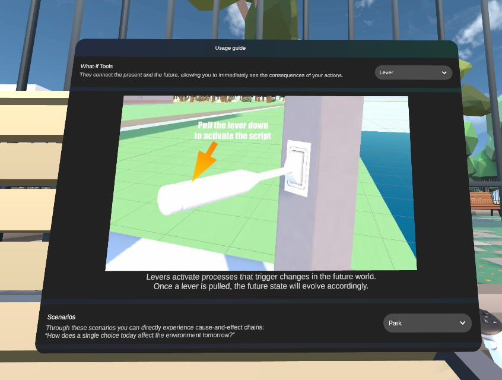

# CameraFilter

Immersive storytelling prototype for visualising alternative data scenarios in Virtual Reality.

Developed as part of research at the [Interactive Media Lab Dresden (TU Dresden)](https://imld.de).

---

## Overview

CameraFilter is a VR prototype designed to explore cause-and-effect chains and "what-if" scenarios through interactive tools and dynamic virtual camera perspectives. It allows users to observe how present choices directly impact the future state of an environment.

### Core Mechanics & What-if Tools
- **Future Preview & Camera:** Look through an interactive screen to inspect alternative world states, switch day/night cycles, accelerate time, or create snapshot portals to travel between timelines.
- **Interactive Levers:** Trigger specific processes that alter future environmental parameters and watch the world evolve.
- **Scenario Exploration:** Experience real-time consequences of decisions across stylized virtual scenes.

---

## Screenshots

### City Environment

*A stylized low-poly urban environment used for data scenario visualisations.*

### Future Preview Camera & Tool UI

*The interactive camera tool showing timeline controls, day/night cycles, and time acceleration options.*

### Interactive Levers

*A dedicated VR interface guide explaining how different leverage points influence future outcomes.*

---

## Developer

- **Timur Gildeev** — [@gtimuri](https://github.com/gtimuri)
